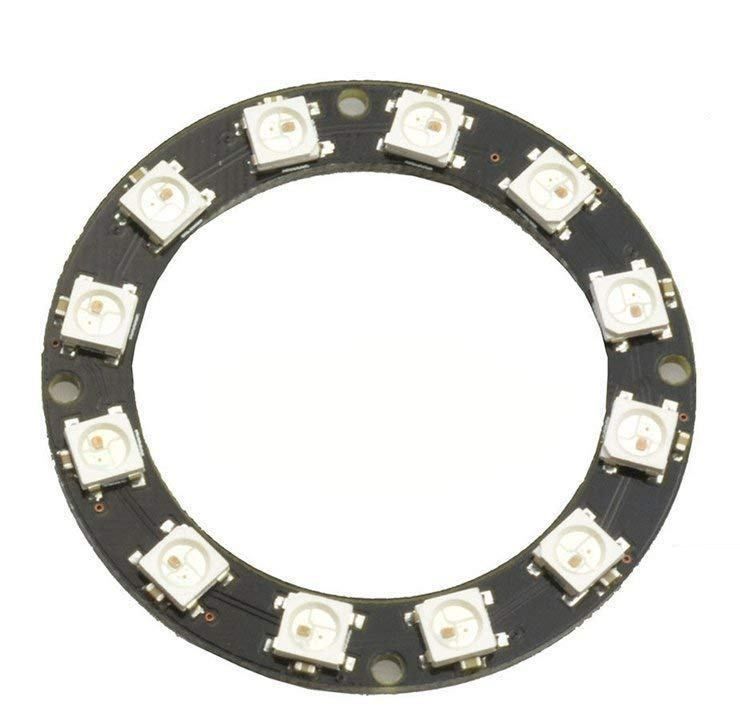

This is an example output from the software.  This uses the WS2812 LED RING.

Essentially, hook up the GLCD to the microcontroller (Ardunio UNO and any other type), compile and program, look at your LED ring and you will see the results on the ring... what could be simplier.

Actual image on the ring

