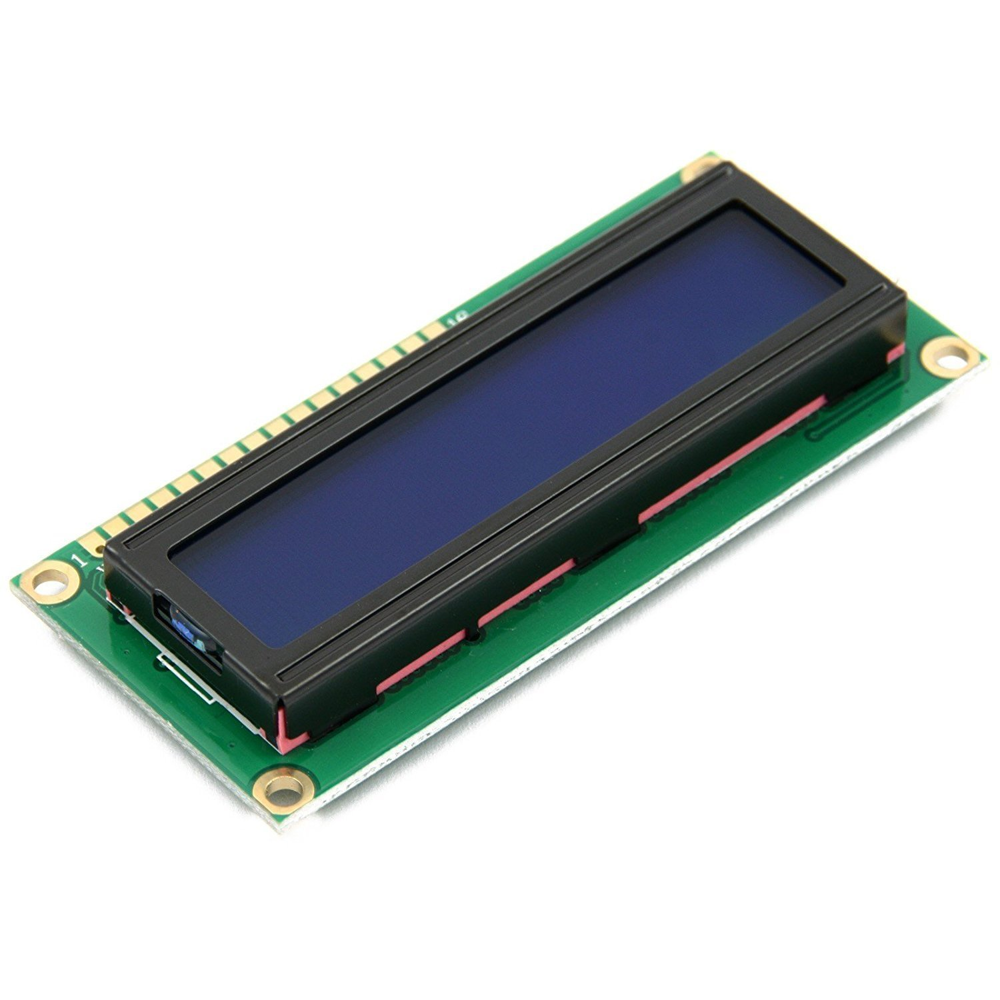

# Product Review: LCD Module Display With Blue Backlight

*What it is*

An LCD display that is 2-lines X 16-characters white with a blue display with a backlight.

*HiLetgo Product*

The HiLetgo GLCD worked at expected when delivered - soldered the through hole pins to the board, connected up and it worked.

The packaging was a solid carboard box with two LCDs sealed in an anti-static wrap bag.

The HiLetgo 1602 LCDs are a bright and the contrast is excellent.

*Rating*

[red]#Excellent product.{nbsp}{nbsp}Fast and easy to use.{nbsp}{nbsp}Cost effective as you get two LCDs provided#

*Technical Details*

The LCD are 1602 Serial LCD Module Display With Blue Backlight HD44780 Controller.{nbsp}{nbsp}The LCDs are low latency and are therefore fast.

The LCD was connected using a 4-wire bus with Enable and RS connected.

*Test Results*

Tested Great Cow BASIC and Arduino - both tested successfully.

This is an example output from the software.

