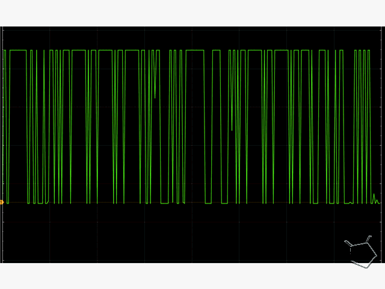

This is an example output from the software.  This examines the GLCD controller.

Essentially, hook up the GLCD to the microcontroller (Ardunio UNO and any other type), compile and program, look at your terminal and you will see the results on the terminal... what could be simplier.

Actual image on the dislay

