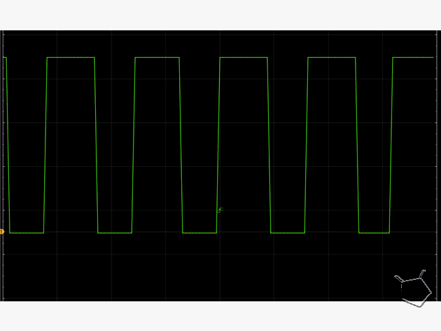

This is an example output from the software.  This demonstration uses the on-board LED only..

Essentially, hook up the UNO, compile and program, look at the on-board LED and you will see the results... what could be simplier.

Actual image on the oscilloscope.

